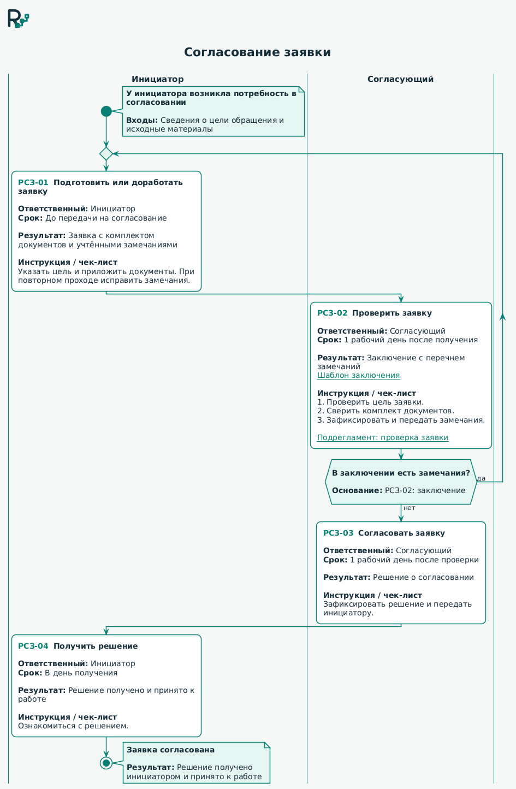
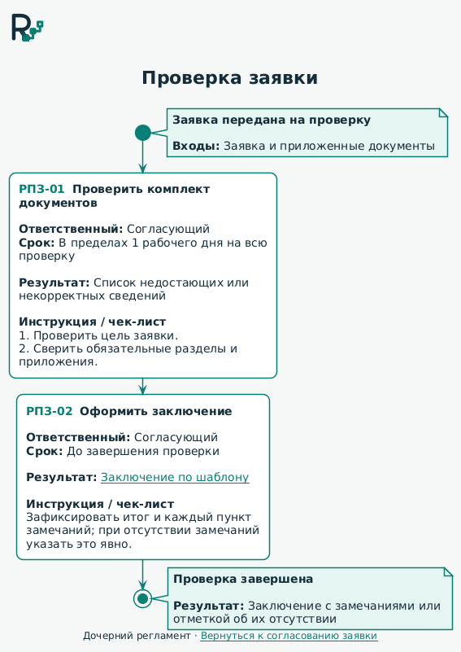
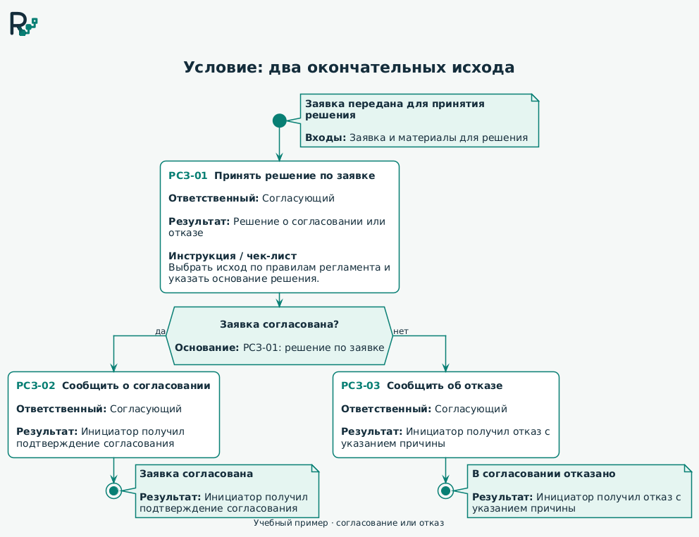

  <picture>
    <source media="(prefers-color-scheme: dark)" srcset="docs/ruleway_design/ruleway-logo-reversed.svg">
    <source media="(prefers-color-scheme: light)" srcset="docs/ruleway_design/ruleway-logo.svg">
    
  </picture>

<h1 align="center">RulewayUML</h1>

  <strong>Понятный процесс. Последовательное действие.</strong> 
  Практики и компоненты для наглядных регламентов на PlantUML.

  <a href="#about">Для чего</a> ·
  <a href="#practices">Практики</a> ·
  <a href="#examples">Примеры</a> ·
  <a href="#components">Компоненты</a> ·
  <a href="docs/specification/">Спецификация</a>

---

## Регламент, по которому понятно, что делать

RulewayUML помогает подойти к описанию процесса как к понятной схеме: **кто действует, что ему нужно и какой результат он передаёт дальше**. Практики можно применять к своим регламентам уже сейчас; компоненты PlantUML создаются для повторного использования типовых элементов.

## Практики

- **Один шаг — одно действие.** Называйте его глаголом: «Проверить заявку», «Согласовать документ». В схемах RulewayUML каждое действие оформляйте компонентом действия.
- **У каждого шага есть ответственный.** Указывайте роль, которая выполняет действие.
- **Вход и результат видны на схеме.** Обозначайте нужные данные, документы и то, что должно получиться.
- **Условия и исключения описаны явно.** Показывайте, когда переходить дальше, а когда возвращаться на доработку.
- **Подробности рядом с действием.** Связывайте шаги с инструкциями и чек-листами, а крупные процессы раскрывайте через подрегламенты.

## Как выглядят регламенты

Ниже — готовые схемы из примеров библиотеки. Нажмите на иллюстрацию, чтобы открыть её в полном размере; по ссылке «Исходник» можно взять код PlantUML за основу своего регламента.

### Согласование заявки

Две роли, четыре действия и возврат на доработку при замечаниях. В каждом шаге видны ответственный, результат, срок и инструкция; начало и завершение описывают границы процесса.

[Исходник](examples/basic_regulation.puml) · [Тот же процесс без дорожек](examples/basic_regulation_no_lanes.puml)

### Проверка заявки — дочерний регламент

Шаг проверки из основной схемы раскрыт в отдельный процесс: проверить комплект документов и оформить заключение по шаблону.

[Исходник](examples/review_regulation.puml) · [Шаблон заключения](examples/materials/review_template.html)

### Согласование или отказ

Учебный пример с двумя окончательными исходами. Условие опирается на результат предшествующего действия, а каждая ветвь завершается уведомлением инициатора и своим итогом.

[Исходник](examples/condition_decision.puml)

Другие примеры: [доработка](examples/condition_rework.puml), [многострочный вопрос](examples/condition_long_text.puml), [минимальные границы](examples/regulation_boundaries_minimal.puml) и [границы с переносами](examples/regulation_boundaries_long_text.puml).

## Компоненты

Доступны [общий стиль](components/style.puml) и четыре компонента:

- [Действие](docs/specification/components/action.md) — идентификатор, наименование, ответственный и результат; по необходимости — инструкция/чек-лист, срок/SLA и ссылка на дочерний регламент.
- [Условие](docs/specification/components/condition.md) — вопрос и основание для выбора пути в стандартных `if` и `repeat while`.
- [Начало](docs/specification/components/start.md) — событие запуска и необходимые входные данные.
- [Завершение](docs/specification/components/end.md) — исход процесса и полученный результат.

Все компоненты автоматически подключают оформление Ruleway. События начала и исходы завершения формулирует автор регламента. Базовая версия PlantUML — `1.2025.10`, как в проверенной Яндекс Wiki.

[Руководство по библиотеке](docs/specification/README.md): подключение, правила построения регламентов, предпросмотр и экспорт схем.

[Скилл для ИИ-агентов](docs/specification/agent_skill.md) — первая сборка для подготовки и редактирования регламентов с локальным экспортом SVG и HTML. [Готовый ZIP `0.0.1`](dist/rulewayuml-0.0.1.zip) хранится в репозитории и подходит в том числе для правки существующей схемы RulewayUML.

---

  <a href="https://plantuml.com/ru/activity-diagram-beta">Синтаксис диаграмм деятельности PlantUML</a>

